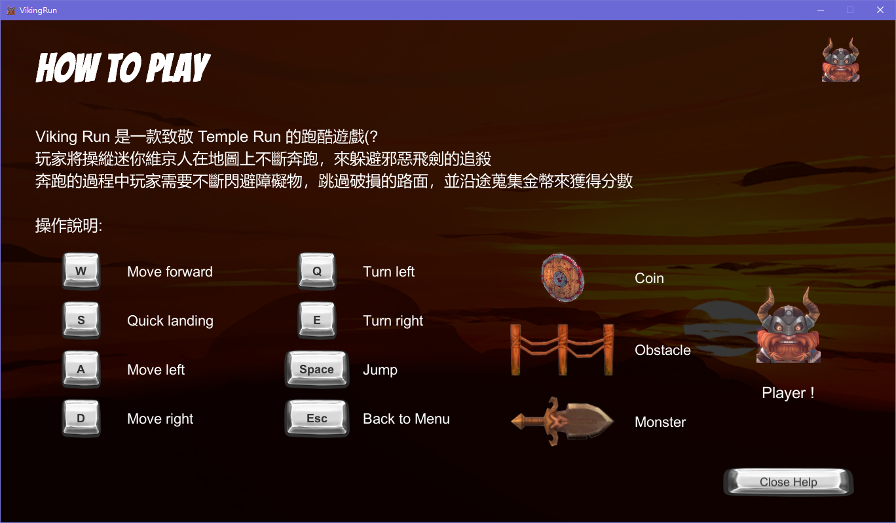
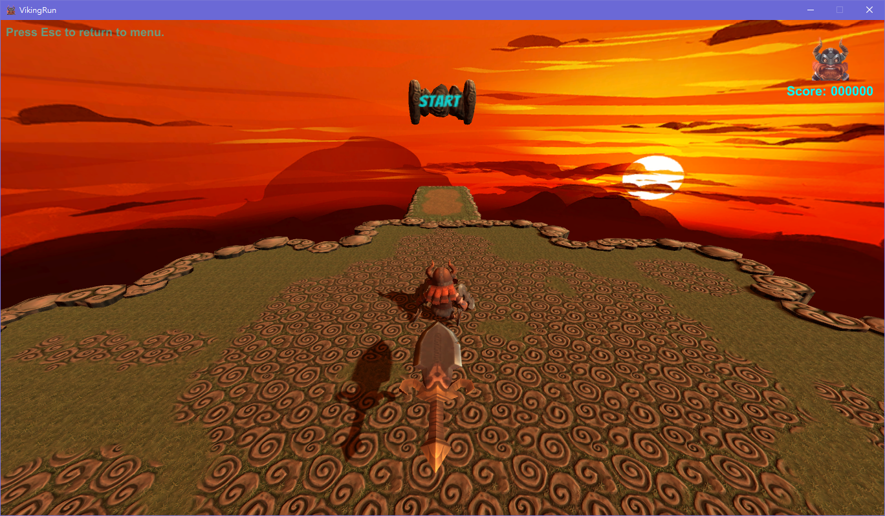
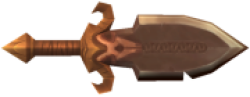
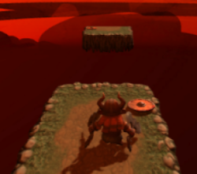
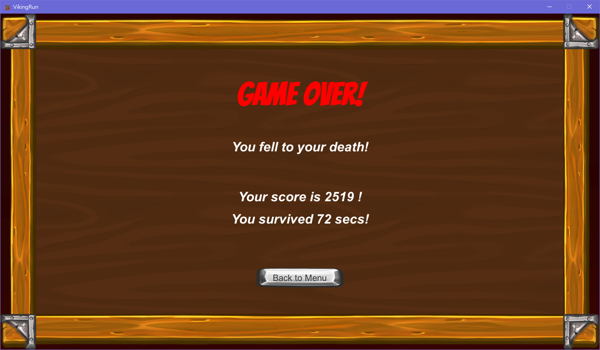

# VikingRun
A shout out to Temple Run！

## Enviroment
### 開發環境
* Windows 10 x86-64
* Unity 2020.3.23f1
* Visual Studio 2017 (for C# scripts)
### 目標平台
* Winsows 10 x86-64
## About VikingRun
Viking Run 是一款致敬 Temple Run 的跑酷遊戲(?  
玩家將操縱迷你維京人在地圖上不斷奔跑，來躲避邪惡飛劍的追殺，  
奔跑的過程中玩家需要不斷閃避障礙物，跳過破損的路面，並沿途蒐集金幣來獲得分數。
## How to play
### 主選單
開啟遊戲後會進入主選單，主選單各按鍵功能如下:
* *Game Start* : 按下後會進入主要遊戲畫面 (下2)  
* *Exit* : 按下後會離開遊戲(關閉程式)  
* *Help* : 按下後會顯示操作說明 (下1)  
### 操作說明頁面
本頁面顯示VikingRun的操作說明及簡介，在按下*Close Help*按鈕後回到主選單

### 遊戲主畫面
玩家所操作的維京人會出生在一個大平台上此時可以自由移動  
(若玩家在通過Start前就跳樓，會自動重生在平台上)  
玩家出生位置：

當玩家跨過*Start*的牌子下方後，遊戲便會開始計分且怪物會開始追擊  
當玩家在一定時間(7s)內沒有到達下一個block的路面便會被怪物(飛劍)追上  
怪物：  
  
Start牌子：  

玩家在逃跑過程中，路面上會有障礙物或破損需跳起閃避，此外拾取路上的金幣可以獲得額外分數  
(分數由存活時間及拾取金幣的數量計算)  
障礙物：  
  
破損路面：  
  
金幣：  

#### 遊戲結束
遊戲會在維京人墜落或被飛劍追上後結束，會顯示遊戲結束畫面，  
畫面包含死因(墜落或被飛劍追上)、分數、存活時間，如下圖所示：

### 按鍵功能
玩家會以鍵盤操作維京人，各個按鍵對應的功能如下：
* W：前進(手動前進)
* S：快速落地(在空中) / 慢速移動(在地面)
* A：往左測移動(平移)
* D：往右測移動(平移)
* Q：往左轉(90度)
* E：往右轉(90度)
* Space：跳躍
* Esc：回到主選單

## Bounus

* T字路口

* Start牌子指示玩家遊戲開始

* 若玩家在通過Start前就跳樓，會自動重生在平台上

* 即時分數顯示及回到主選單提示(提示有文字特效！)

* 回收之前的路面、金幣及障礙物，避免佔用過多的RAM，  
  也避免繞回來時看到重複的路

* 加入跳躍(墜落)動畫

* 符合主題的背景

* 遊戲中的Help頁面除了操作說明還有遊戲簡介，  
  且有icon提示每種物體分別是什麼
  
* 精美的GameOver畫面，除了顯示分數還有死因及存活時間

* 遊戲執行檔有icon

* 高難度路面，全程沒有圍欄

## Feedback
不得不說這作業真的有點花時間，尤其是要顧慮到細節(icon、圖標、文字效果等等)、遊戲邏輯的完整，  
在處理Script及UI上花了不少時，整體而言是個有趣的作業，可以熟悉初學Unity遊戲製作需要注意的各個方面。
